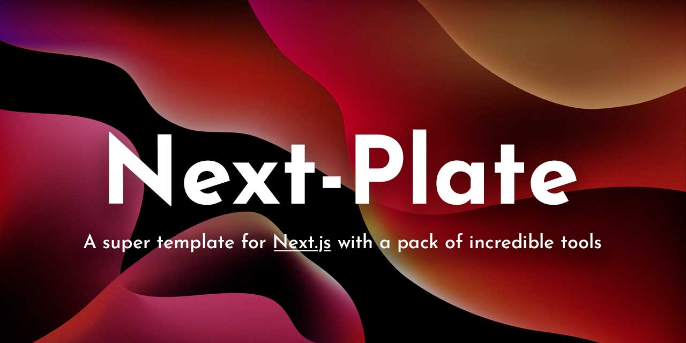
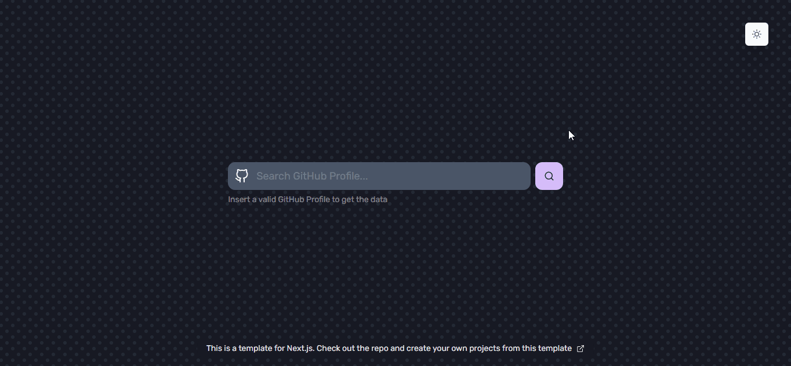
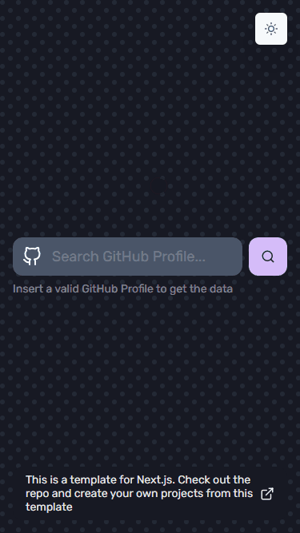

<!-- markdownlint-disable MD014 -->
<!-- markdownlint-disable MD026 -->
<!-- markdownlint-disable MD033 -->
<!-- markdownlint-disable MD041 -->

<h1 align="center">
  Next-Plate
</h1>

<!-- Banner Section -->
<p align="center">
  
</p>
<h3 align="center">
  🦸‍♀️ A super template for Next.js with a pack of incredible tools
</h3>

---

<!-- Badges Section -->
<p align="center">
  <a href="https://vercel.com" title="Open Vercel Website">
    
  </a>
  <br>
  <a href="./LICENSE" title="Show the MIT License">
    
  </a>
  <br>
  
  
  
</p>

<!-- Desktop/Mobile GIF Demo Section -->
<div align="center">
  
  
</div>

---

<!-- Translations Section -->

## 🌎 Translations

<kbd>[](./README.md)</kbd>
<kbd>[](./public/docs/translations/README.pt-BR.md)</kbd>

<!-- Link Demo Section -->

## 🚀 [Demo →](https://next-plate.vercel.app)

Deploy your own copy of this template in just a few clicks!

<div>
 <a href="https://vercel.com/import/project?template=https://github.com/gmatthewsfeuer/next-plate" title="Deploy to Vercel">
  
 </a>
 <a href="https://app.netlify.com/start/deploy?repository=https://github.com/gmatthewsfeuer/next-plate" title="Deploy to Netlify">
  
 </a>
</div>

<!-- Introduction Section -->

## 📖 Introduction

This is a **complete template** with all you need for your **next React projects** and all the **best practices** of **[JAMStack](https://jamstack.org)**.

This template have a bunch of folders, code examples and configurations. Feel free to edit or remove them, including this README!

**Customize and enjoy!**

<!-- Features Section -->

## 🌟 Features

This project features all the latest tools and good practices in web development!

### Framework

- ⚛️ **[Next.js](https://nextjs.org)** – A complete React framework for hybrid and server rendering

### Data Fetching

- ✳️ **[React Query](https://react-query.tanstack.com)** – Hooks for fetching, caching and updating asynchronous data in React
- ❇️ **[SWR](https://swr.vercel.app)** (alternative for React Query) – A React Hooks library for data fetching
- 🔄 **[Axios](https://github.com/axios/axios)** – Promise based HTTP client for the browser and Node.js

### State Management

- 🐻 **[Zustand](https://zustand-demo.pmnd.rs)** – A small, fast and scalable bearbones state-management solution using simplified flux principles

### Design System and Animations

- 🎨 **[Chakra-UI](https://chakra-ui.com)** – A simple, modular and accessible component library that gives you the building blocks to build your React applications
- 🎞️ **[Framer Motion](https://www.framer.com/motion)** – A production-ready motion library for React
- ✨ **[React Icons](https://react-icons.github.io/react-icons)** – A collection of popular icons to React projects

### Form Validation

- 📋 **[React Hook Form](https://react-hook-form.com)** – Performant, flexible and extensible forms with easy-to-use validation
- 🚨 **[Yup](https://github.com/jquense/yup)** – A schema builder for runtime value parsing and validation

### Tests

- 🃏 **[Jest](https://jestjs.io)** – A delightful JavaScript Testing Framework with a focus on simplicity
- 🐙 **[Testing Library](https://testing-library.com)** – Simple and complete testing utilities that encourage good testing practices

### Design Patterns

- ⛔ **[ESLint](https://eslint.org)** – Find and fix problems in your JavaScript code
- 🎀 **[Prettier](https://prettier.io)** – An opinionated code formatter, supporting multiple languages and code editors
- 🐺 **[Husky](https://github.com/typicode/husky)** – Modern native Git hooks made easy
- 💩 **[lint-staged](https://github.com/okonet/lint-staged)** – Run linters against staged git files and don't let 💩 slip into your code base
- 📓 **[commitlint](https://commitlint.js.org)** – Helps your team adhering to a commit convention

### Analysis

- 🕵🏻‍♂️ **[why-did-you-render](https://github.com/welldone-software/why-did-you-render)** (optional) – Notify you about potentially avoidable re-renders

### Additional Plugins

- 🗃️ **[next-compose-plugins](https://github.com/cyrilwanner/next-compose-plugins)** – Provides a cleaner API for enabling and configuring plugins for Next.js
- 📱 **[next-pwa](https://github.com/shadowwalker/next-pwa)** – A PWA plugin for Next.js
- 📈 **[next-seo](https://github.com/garmeeh/next-seo)** – A plugin that makes managing your SEO easier in Next.js projects

<!-- Procedures Section -->

## ▶️ Getting Started

### 📙 Creating a New Repository on GitHub

1. Click on "**Use this template**" button
2. Configure your new repository and click on "**Create repository from template**" button
3. Now you can clone the generated repository to your local machine:

```bash
 $ git clone https://github.com/<your-github-login>/<name-of-your-generated-repository>.git
```

### 🛠️ Installation

Before you can start developing your super application, you need to install the project's dependencies.

Move yourself to the root of the project:

```bash
$ cd <name-of-your-generated-repository>
```

Install all dependencies of the project:

```bash
$ npm install
# or
$ yarn install
```

### ⌨️ Development

Once all dependencies have been installed, you can run the local development server:

```bash
$ npm run dev
# or
$ yarn dev
```

Now just code!

### 🖥️ Production

After applying the changes, you can generate a build to test and/or deploy to your production environment.

Make a production build:

```bash
$ npm run build
# or
$ yarn build
```

And then run the build:

```bash
$ npm start
# or
$ yarn start
```

### ⚙️ Extra Configurations

<details>
 <summary>SWR</summary>

 <h4>Swap to SWR</h4>

Install the SWR on the project:

```bash
$ npm install swr
# or
$ yarn add swr
```

Remove all import lines, providers and code blocks of React Query located in `src/pages/_app.tsx` and `src/pages/[login].tsx`.

That's it! Use the `useFetch` function to fetch your data in the application.

Wanna see a demo? Uncomment all import lines and code blocks of SWR implementation on `src/pages/[login].tsx`.

</details>

<details>

 <summary>Why Did You Render</summary>

 <h4>How to Activate</h4>

Put the `babel.config.js` file (located in the path `src/scripts`) in the project root.

Uncomment the `wdyr` import line on `pages/_app.tsx`.

That's it! Now you can monitore React re-renders!

 <h4>How to Uninstall</h4>

Just delete the `babel.config.js` and `wdyr.ts` files, remove `wdyr` import line on `src/pages/_app.tsx` and uninstall it:

```bash
$ npm uninstall @welldone-software/why-did-you-render
# or
$ yarn remove @welldone-software/why-did-you-render
```

</details>

<!-- License Section -->

## 📜 License

Although you don't have to, if you reuse this template for your projects I would appreciate it if you would **credit me and provide a link to my GitHub profile in the footer of your project**. Thanks!

This project is licensed under the **MIT License** - see the [LICENSE](LICENSE) page for details.

<!-- Acknowledgment Section -->

---

### ⭐ Give a star to maintain this project!

### ❤️ Thanks for your attention!

### 👨‍💻 Good Hacking!
